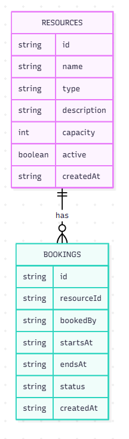

# dv1677-ht26-grupp5-backend

## Gruppmedlemmar

| Namn                 | GitHub        |
| -------------------- | ------------- |
| Rebaz Mohammad Ahmad | rebahama      |
| Tuan Anh Pham        | tuananhpham95 |

## Projektval

Vi har valt bokningssystem resource-booking-ht26

Vi båda två har erfarenhet av liknande projekt och kände att detta var mest passande för oss att jobba med.

## Datamodellering
Följande datamodellering har används för tillfället för projektet:

## Teknikval

**Frontend-ramverk:** React / Vue / Svelte

React kommer att användas eftersom att det finns en stor community och väldigt bra dokumentation, även tidigare erfarenhet av React finns som gör att valet hamnade på React.

## Kör lokalt

1. git clone https://github.com/rebahama/dv1677-ht26-grupp5-backend
2. cd dv1677-ht26-grupp5-backend
3. cp .env.example .env
4. npm install
5. npm start

**Miljövariabler** (se .env.example):

| Variabel                          | Beskrivning                      |
| --------------------------------- | -------------------------------- |
| MONGODB_URI = Din Mongodb databas | Anslutningssträng till MongoDB   |
| PORT=3000                         | Anslutningssträng till npm start |

## Tester

För att köra tester gör följande:

1. Gå in i root foldern.
2. Starta tester genom att skriva in npm test

### Vad som har testats

Vi har testat 4 olika HTTP metoder,

- GET
- POST
- PUT
- DELETE

Dessa tester har körts på API routerna för att verifiera respons datan ifrån API routerna. Även att kontrollera test databasen för att verifiera all nytilkommen data som skapades med testerna finns i test databasen.

## Driftsatt

- Backend: https://dv1677-spock.nplab.bth.se/resources
- Frontend: https://rebahama.github.io/dv1677-ht26-grupp5-frontend

## Tillvägagångssätt

Dokumentera löpande vad ni gjort och hur ni löst problem.

- Vecka 1: Repot skapades och lades till med Klona + nytt repo, sedan kördes npm install för att installera appen. Alla steg gick bra och applikationen startades upp utan problem. Även npm audit kördes som visade: "3 moderate severity vulnerabilities", npm audit fix lyckades inte fixa dessa 3 stycken vulnerabilites.

- Vecka 2: Implementerade uppdatering av resurs. updateOne lades till i resources.mjs. app.mjs fick PUT /resources/:id och POST /resources/:id så att både API och HTML-formuläret kan spara. Formuläret postar till /resources/:id vid redigering. Knappen “Redigera resurs” lades till på resurssidan. Testat: nytt kan skapas och befintligt kan uppdateras .

- Vecka 3: Gjorde en migrering ifrån SQL till MongoDb, först installerades mongoDB sedan skapades en databas i MongoDb Atlas. Efter detta så gjordes database.mjs filen om till att kunna köra en anslutning till den nya databasen ifrån föregående SQL. Syntaxen för att skapa och rendera datan i den nya databasen gjordes om i booking.mjs filen och resources.mjs, detta för att kunna utföra samma funktioner som tidigare när sql databasen fanns som anslutning. När allt detta var klart så lades samma data som tidigare in i databasen ifrån localhost:3000 gränsnittet och allting fungerade, även i Mongo Db Atlas sidan så kontrollerades att all data fanns på plats. Backend gjordes även om till ett JSON-API: EJS togs bort och alla routes svarar med JSON.

- Vecka 4: Installerade Vitest för att köra själva testerna, Supertest användes till att testa Express API routerna. Även MongoDb memory server användes till att temporärt lägga in test datan istället för att använda sig av produktions databasen. Konfiguerade om i database.mjs filen så att när script test körs då används MongoDb memory och när "npm start" körs då är det produktions databasen som körs. Även server.mjs filen skapades så att när tester körs igång med "npm test" då kommer inte servern att startas igång pga testerna. Backend containeriserades och driftsattes på VPS:en dv1677-spock med Docker, Caddy och GitHub Actions. Flera fel längs vägen (SQLite i imagen, memory-server i produktion, saknad PORT, Atlas-IP) åtgärdades. API:t är nåbart via HTTPS.
